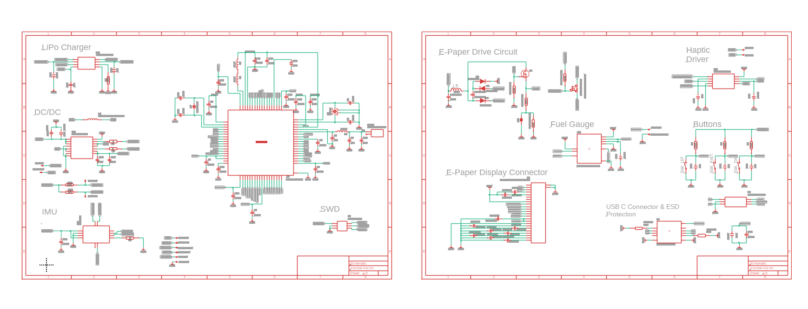
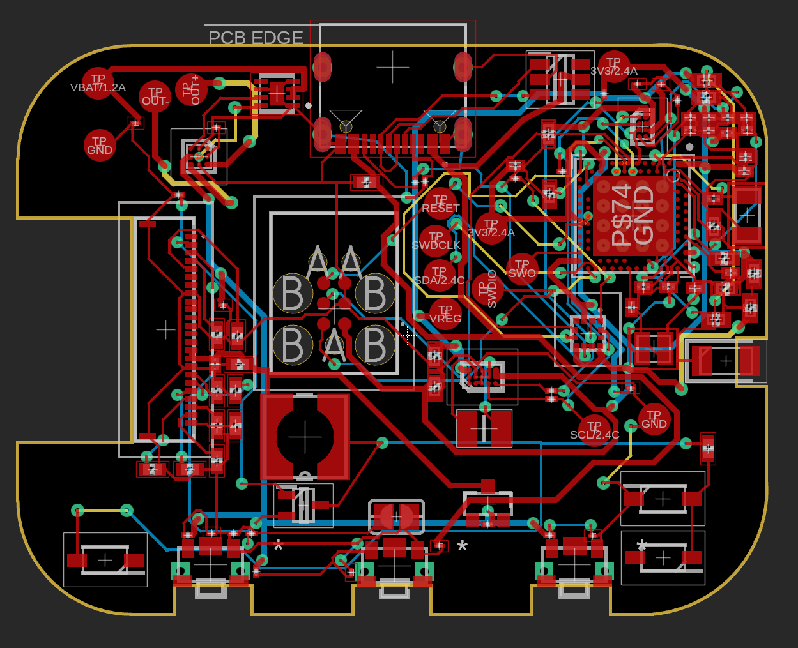
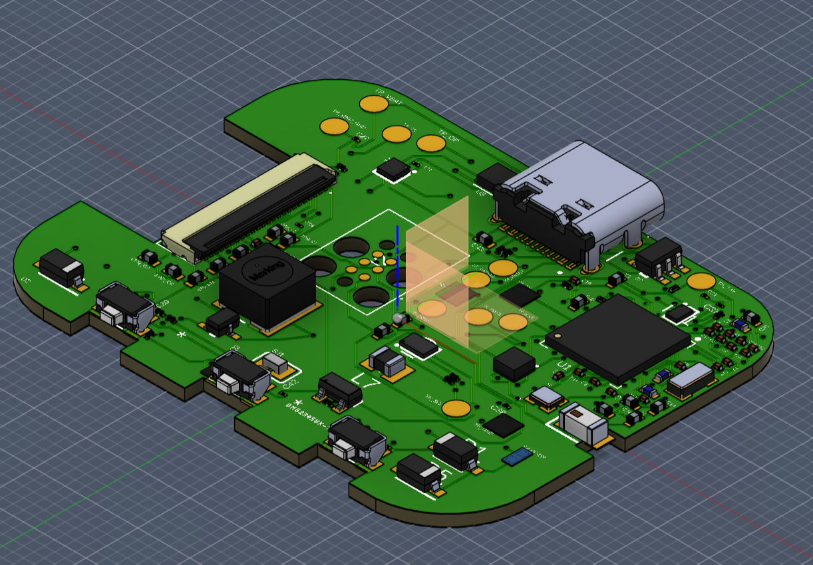
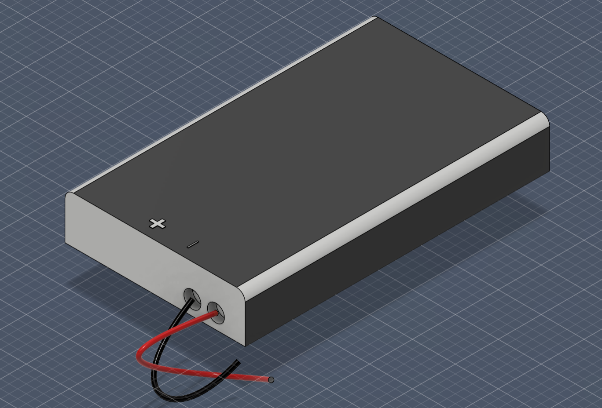
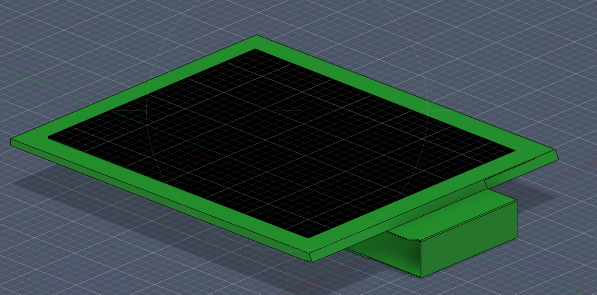
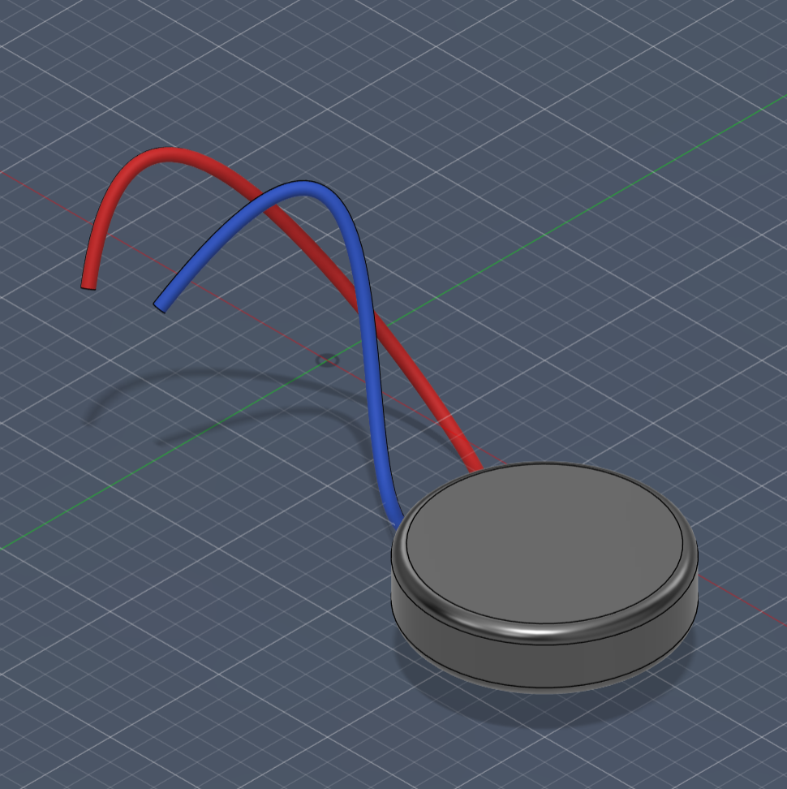
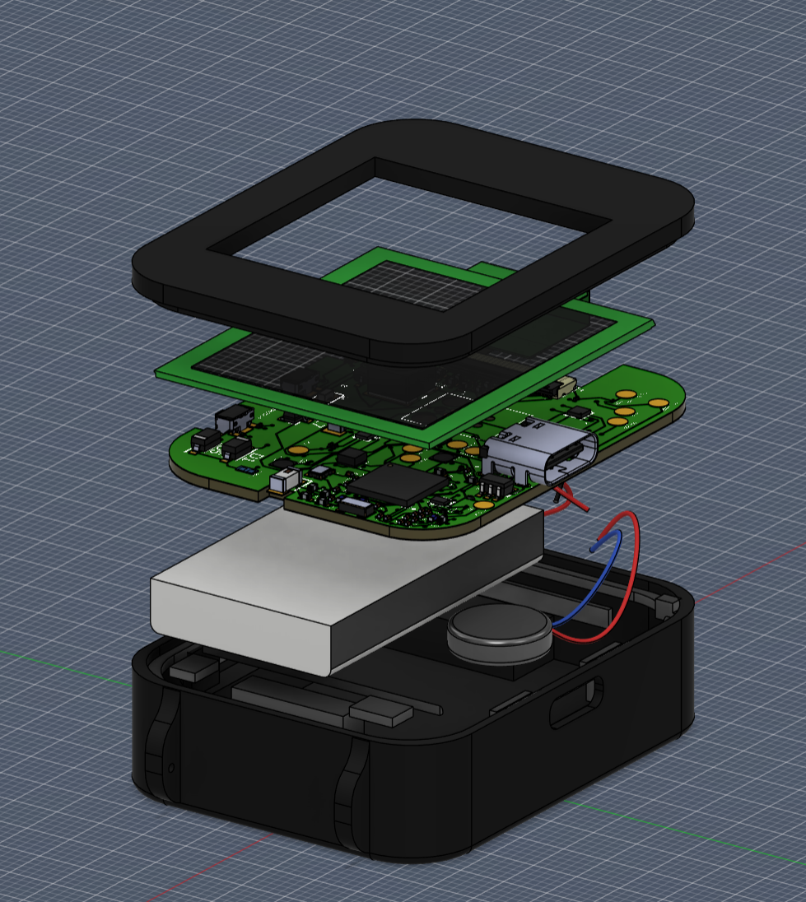

# InkTime Watch
---

## Descriere generala

InkTime este un ceas inteligent bazat pe microcontroller-ul **nRF52840** , care utilizeaza un display E-Paper (cerneala electronica) pentru afisarea orei si a altor informatii. Proiectul include design complet de schematic, PCB pe 4 straturi si modelare 3D a ansamblului, realizate in Autodesk Fusion.

Principalele caracteristici:
- Microcontroller nRF52840 cu Bluetooth 5.0 si procesor ARM Cortex-M4
- Display E-Paper conectat prin SPI
- Accelerometru/IMU pentru detectia miscarii (step counter, wake-on-wrist)
- Baterie LiPo cu circuit de incarcare dedicat
- Regulator DC/DC pentru tensiune stabila de 3.3V
- Fuel Gauge pentru monitorizarea nivelului bateriei
- Driver haptic pentru feedback vibrotactil
- Protectie ESD pe linia USB-C
- Conectivitate USB-C pentru incarcare si programare
- 3 butoane fizice pentru interactiune


---

## Diagrama bloc

```
                         +-------------------+
                         |    Baterie LiPo   |
                         +--------+----------+
                                  |
                         +--------v----------+
                         |  LiPo Charger     |  <-- USB-C (5V / VBUS)
                         |  BQ25180YBGR      |
                         +--------+----------+
                                  | VBAT (3.7-4.2V)
                         +--------v----------+
                         |  Fuel Gauge        |  <-- I2C --> nRF52840
                         |  MAX17048G+T10     |
                         +--------+----------+
                                  |
                         +--------v----------+
                         |  DC/DC Regulator  |  <-- I2C --> nRF52840
                         |  RT6160AWSC       |
                         +--------+----------+
                                  | 3V3
          +-----------------------+-----------------------+
          |                       |                       |
+---------v---------+   +---------v---------+   +---------v---------+
|   nRF52840 (U1)   |   |  ESD Protection   |   |   Butoane (x3)    |
|   Microcontroller |   |  USBLC6-2SC6Y     |   |   EVP-AKE31A      |
+---------+---------+   +-------------------+   +-------------------+
          |
    +-----+------+------+------+
    |            |      |      |
+---v---+  +----v--+  +-v---+ +-v---------+
| SPI   |  |  I2C  |  | SWD | | GPIO/ANT  |
+---+---+  +---+---+  +-----+ +-----------+
    |          |
+---v---+   +--+--+--+--+
|E-Paper|   | IMU | Haptic|
|Display|   |BMA423|DRV2605|
+-------+   +-------+-----+
```

---

## Bill of Materials (BOM)

| Cantitate | Componenta | Descriere | Referinta | 
|:---------:|:----------:|:---------:|:---------:|
| 1 | nRF52840 | Microcontroller ARM Cortex-M4, BT 5.0 | U1 | 
| 1 | BQ25180YBGR | LiPo Charger IC, 8-DSBGA | IC1 | 
| 1 | DRV2605YZFR | Haptic Driver ERM/LRA, 9-BGA | IC2 |
| 1 | BMA423 | IMU Accelerometru triaxial 12-bit | IC3 |
| 1 | MAX17048G+T10 | Fuel Gauge 1-Cell ModelGauge | U3 | 
| 1 | RT6160AWSC | Buck-Boost DC/DC Regulator I2C, 15-WL-CSP | IC9 | 
| 1 | USBLC6-2SC6Y | ESD Protection TVS Diode, SOT-23-6 | D3 | 
| 1 | KH-TYPE-C-16P | Conector USB-C 16 pini | J4 |
| 1 | 503480-2400 | Conector FPC/FFC 0.5mm 24 circuite | J1 | 
| 1 | DMG2305UX-7 | P-Channel MOSFET 20V/4.2A SOT-23 | Q2 | 
| 1 | SI1308EDL-T1-GE3 | N-Channel MOSFET 30V/1.5A SC-70 | Q3 | 
| 3 | MBR0530 | Dioda Schottky 30V/500mA SOD-123 | D1, D2, D5 | 
| 3 | EVP-AKE31A | Buton tactil SMD ultra-subtire | SW_DN, SW_ENT, SW_UP | 
| 1 | 2450AT18B100E | Antena 2.45GHz SMD | ANT1 | 
| 1 | FTC252012SR47MBCA | Inductor SMD 0.47uH 2016 | L7 | 
| 1 | 744043680 | Inductor SMD 68uH WE-TPC | L5 |
| 1 | TC2030-IDC | Conector Tag-Connect 6 pini SWD | J2 |
| 1 | X1 (32MHz) | Crystal 32MHz 2016 SMD | X1 |
| 1 | X2 (32.768kHz) | Crystal 32.768kHz 3215 SMD | X2 | 
| ~50 | Condensatoare SMD | 0201/0402, diverse valori (1pF - 22uF) | Cx | 
| ~15 | Rezistoare SMD | 0201, diverse valori (2.2Ω - 10kΩ) | Rx |
| ~4 | Inductoare SMD | 0402, diverse valori (3.9nH - 15nH, 10uH) | Lx |
| 14 | Test Pad TP20R | Test pad-uri SMD 2mm | TP_* |
| 1 | Solder Jumper SJ | Jumper SMD | SJ1 |

---

## Descrierea functionalitatii hardware

## Funcționalitate hardware

### Interfețe de comunicație
- **I2C**: LiPo Charger, DC/DC, IMU, Fuel Gauge, Haptic Driver  
- **SPI**: E-Paper Display Connector  

### Componente și roluri

- **nRF52840**  
  Microcontroller-ul principal care coordonează întreaga funcționalitate a plăcii.

- **IMU (Accelerometru)**  
  Măsoară accelerația pe cele trei axe.

- **LiPo Charger**  
  Responsabil pentru încărcarea bateriei.

- **DC/DC**  
  Stabilizator de tensiune ce furnizează 3.3V stabili întregii plăci.

- **E-Paper Drive Circuit**  
  Controlează funcționarea display-ului E-Paper.

- **Fuel Gauge**  
  Monitorizează nivelul de încărcare al bateriei.

- **Haptic Driver**  
  Controlează vibrațiile actuatorului (shaker).

- **USB-C Connector**  
  Asigură interfața de conectare USB.

- **ESD Protection**  
  Protejează placa împotriva descărcărilor electrostatice.

---

## Pinii nRF52840

Tabelul de mai jos descrie alocarea pinilor microcontroller-ului:

| Pin nRF52840 | Semnal | Modul conectat | Interfata | Descriere |
|-------------|--------|---------------|-----------|-----------|
| VDD | 3V3 | Alimentare | - | Alimentare la 3.3V |
| VSS | GND | Masa | - | Referinta de masa |
| P0.02/AIN0 | SCK | E-Paper Display | SPI | Clock serial SPI |
| P0.03/AIN1 | MOSI | E-Paper Display | SPI | Date catre display (Master Out Slave In) |
| P0.05/AIN3 | CS | E-Paper Display | SPI | Chip Select display |
| P0.15 | EPD_RST | E-Paper Display | GPIO | Reset display |
| P0.16 | EPD_DC | E-Paper Display | GPIO | Data/Command select |
| P0.17 | EPD_BUSY | E-Paper Display | GPIO | Stare ocupata display |
| P0.06 | SCL | IMU, LiPo Charger, DC/DC, Fuel Gauge, Haptic | I2C | Clock linie I2C |
| P0.07 | SDA | IMU, LiPo Charger, DC/DC, Fuel Gauge, Haptic | I2C | Date linie I2C |
| P0.08 | IMU_INT2 | BMA423 | GPIO | Intrerupere 2 accelerometru |
| P1.08 | IMU_INT1 | BMA423 | GPIO | Intrerupere 1 accelerometru |
| P0.10/NFC2 | FUELGAUGE_ALT | MAX17048 | GPIO | Alarma nivel scazut baterie |
| P0.11 | CHARGER_PG | BQ25180 | GPIO | Semnal Power Good charger |
| P0.12 | HAPTIC_EN | DRV2605 | GPIO | Enable driver haptic |
| P0.13 | BTN_UP | SW_UP | GPIO | Buton sus |
| P0.14 | BTN_ENT | SW_ENT | GPIO | Buton enter/confirmare |
| P1.02 | BTN_DN | SW_DN | GPIO | Buton jos |
| D+ | USB_DP | USB-C / ESD | USB | Date USB diferentiale pozitive |
| D- | USB_DM | USB-C / ESD | USB | Date USB diferentiale negative |
| VBUS | 5V USB | LiPo Charger | - | Alimentare 5V din USB |
| SWDIO | SWDIO | TC2030-IDC (J2) | SWD | Date programare/debug |
| SWDCLK | SWDCLK | TC2030-IDC (J2) | SWD | Clock programare/debug |
| SWO | SWO | TC2030-IDC (J2) | SWD | Trace output |
| P0.18/RESET | RESET | TC2030-IDC (J2) | GPIO | Reset hardware microcontroller |
| ANT | RF | 2450AT18B100E | RF | Antena Bluetooth 2.4GHz |
| XC1, XC2 | XTAL_32M | X1 (32 MHz) | Clock | Sursa de ceas principala |
| XL1, XL2 | XTAL_32K | X2 (32.768 kHz) | Clock | Sursa de ceas RTC (low power) |
| DEC1-DEC5 | GND | - | - | Condensatoare decuplare regulatoare interne |

---

## Design PCB si modelare 3D

### Stackup PCB — 4 straturi

Placa a fost realizata pe **4 straturi** pentru a asigura integritate de semnal buna si o rutare curata:

| Strat | Rol |
|-------|-----|
| Top (L1) | Rutare semnal + componente SMD |
| L2 | Plan de masa (GND) |
| L3 | Plan de 3.3V (VCC) |
| Bottom (L4) | Rutare semnal secundar |

Avantajele acestui stackup:
- Planul de masa L2 ofera un return path scurt pentru toate semnalele de pe L1
- Planul de 3.3V L3 reduce impedanta de alimentare si EMI
- Via-urile de semnal au return path minim intre straturi adiacente

### Decizii de design notabile

**Antena si decupaj PCB**: Antena 2450AT18B100E este pozitionata in coltul inferior al placii. Sub jumatatea neconectata electric a antenei, s-a realizat un **decupaj al substratului** (cutout) pentru a imbunatati performanta de radiatie si a evita absorbtia de semnal RF de catre materialul FR4.

**Via-in-pad**: Pentru componentele BGA (BQ25180, RT6160, DRV2605, MAX17048) cu pitch mic, s-au folosit **via-in-pad** — via-uri plasate direct sub pad-urile componentelor. Aceasta tehnica permite rutarea semnalelor in spatiu limitat, dar necesita umplere cu rasina (plugged vias) pentru a asigura planitate la lipire.

**Test pad-uri**: Sunt prevazute 14 test pad-uri (TP20R) pentru toate semnalele importante: 3V3, VBAT, GND, SDA, SCL, SWDCLK, SWDIO, SWO, RESET, VREG. Acestea faciliteaza testarea si depanarea dupa asamblare.

**Conexiuni baterie si shaker**: Bateria LiPo si motorul haptic (shaker) sunt conectate la PCB prin fire sudate pe test pad-urile dedicate (TP_VBAT, TP_VBAT_GND, respectiv pad-urile haptic driver-ului).

### Modelare 3D

Modelarea 3D a ansamblului ceasului a fost realizata in **Autodesk Fusion** si include:

- **PCB 3D** cu toate componentele plasate si orientate corect
- **Baterie LiPo** — model la nivel mediu de detaliu, cu fire de legatura rosu (+) si negru (-)
- **Display E-Paper** — model cu cadru verde si suprafata activa neagra, cu conector FPC/FFC
- **Shaker (motor haptic)** — model cilindric cu fire rosu si albastru
- **Carcasa** — carcasa inferioara si cadru superior de retentie display, fabricate din material negru
- **Exploded View** — vedere explodata verticala a ansamblului complet
- **Animatie** exploded view (disponibila in folderul Mechanical)

---

## Imagini

### Schematic



### PCB 2D



### PCB 3D



### Baterie



### Display E-Paper



### Shaker (Motor Haptic)




### Exploded View




## Diagrama de sistem — SVG

Diagrama bloc interactiva este disponibila in fisierul `inktime_diagram.svg` din radacina proiectului.

---
